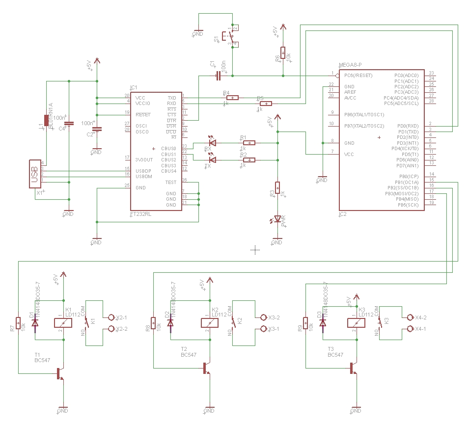
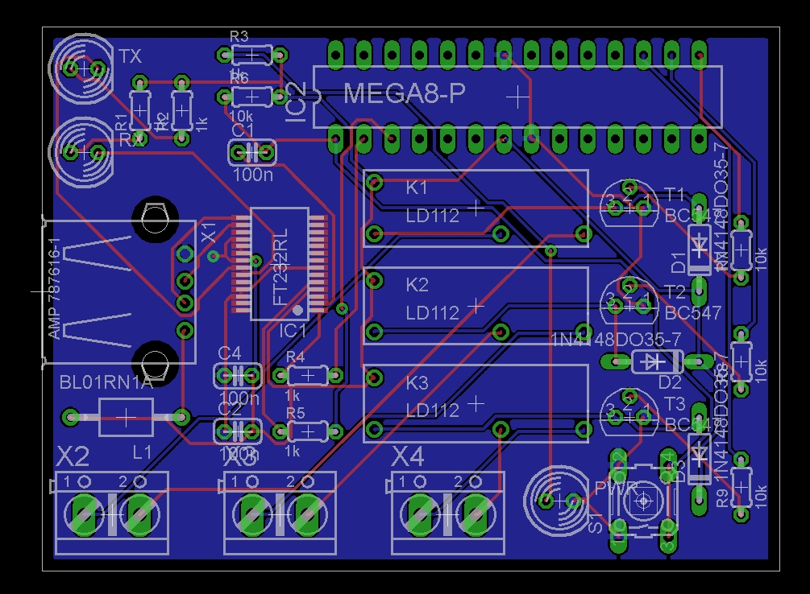

# 3-Channel-USB-IO-Board

## Steuern mit USB und AVR ATmega8 / 3-Kanal-Relais Karte

Bei diesem Projekt handelt es sich um ein 3-Kanal-Relais Board, das über USB gesteuert wird und in Cadsoft Eagle 7 Light entwickelt wurde. Für den USB-Anschluss wird der FTDI FT232RL USB/Seriell-Umsetzer IC genutzt, der die Kommunikation zwischen PC und dem Mikrocontroller ATmega8 übernimmt, für Windows/Linux gibt es entsprechende Treiber. An Port B des Mikrocontrollers sind drei Relais-Ausgänge angeschlossen, über die man kleinere Lasten wie Schrittmotoren usw. anschließen kann. Die Stromversorgung erfolgt komplett über die USB-Schnittstelle mit 5V/500mA.

Hinweis: Schaltplan/PCB-Layout wurden von mir nicht getestet, es handelt sich lediglich um einen frühen Prototyp.

